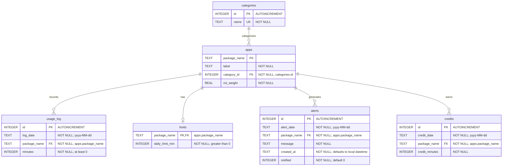

# RotMeter entity relationships

Every app belongs to one category. Each app can have zero or one limit and many usage, alert, and credit rows. `usage_log` also has a composite UNIQUE constraint on `(log_date, package_name)`; its individual columns are not independently unique. Alert and credit date/package pairs have no declared UNIQUE constraint: usage triggers enforce the intended daily behavior during normal app writes. The two views are derived queries, not additional tables.

## 3NF justification

Values are atomic, and non-key attributes depend on the whole key: an app's package determines its label, category, and weight; a usage date/package pair determines its minutes; a limit's package determines its limit. Category names are stored only in `categories`, and usage/limit records refer to apps instead of duplicating their labels or weights. This removes partial dependencies and transitive category-name dependencies from those relations.

Alerts store historical message text and notification state as properties of an alert event. Credits deliberately store a trigger-maintained projection of productive usage, so there is controlled redundancy between `credits.credit_minutes` and `usage_log.minutes`. The core tables follow 3NF under these dependencies; the credit projection should be explained in the viva as a stored derivative maintained by SQL triggers, rather than a claim that the entire database has no redundancy.
